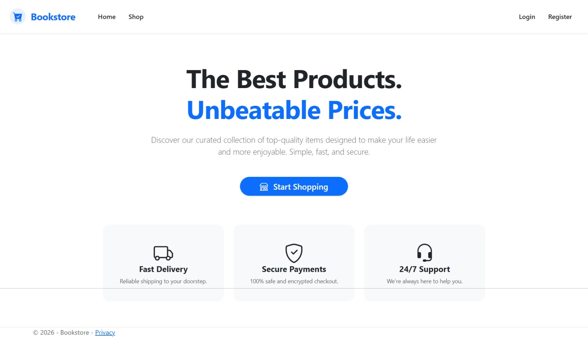
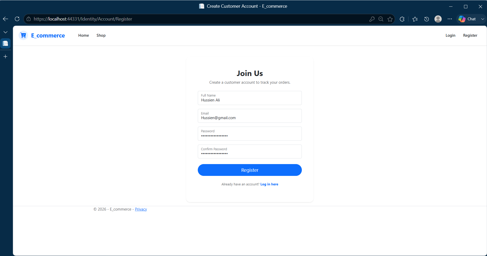
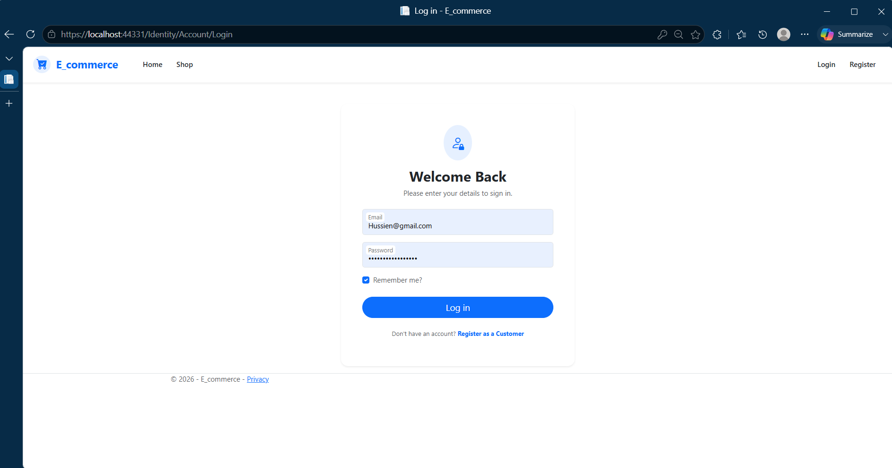
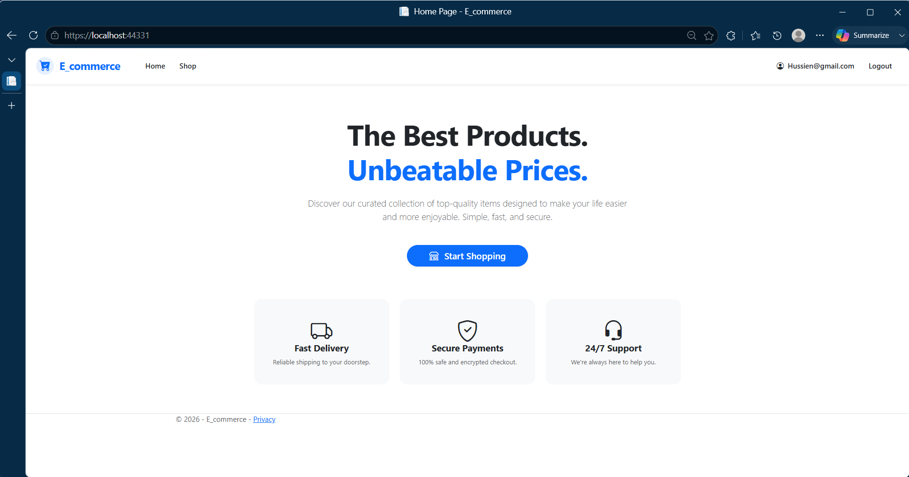
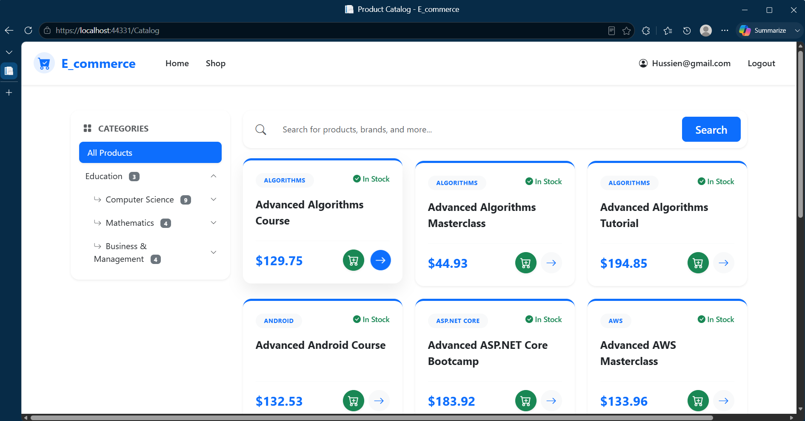
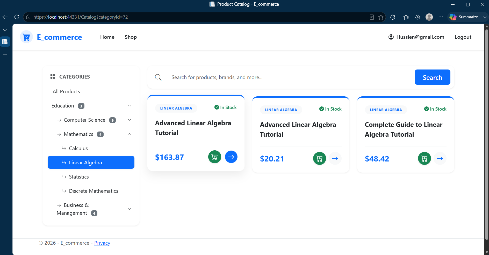
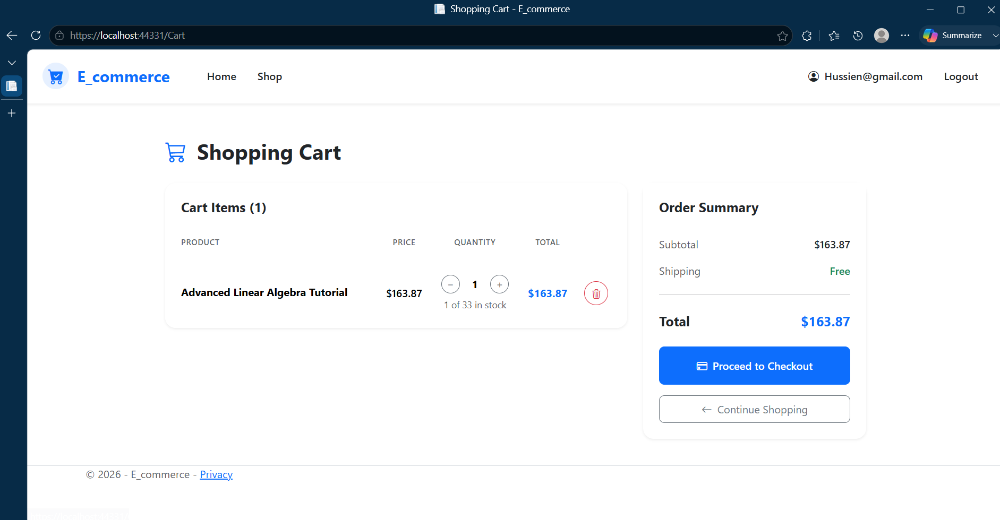
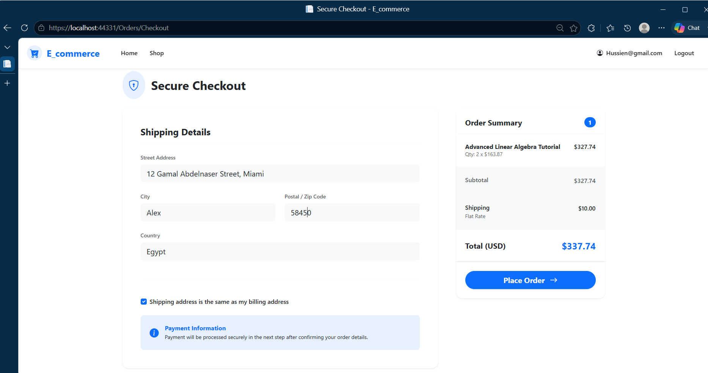
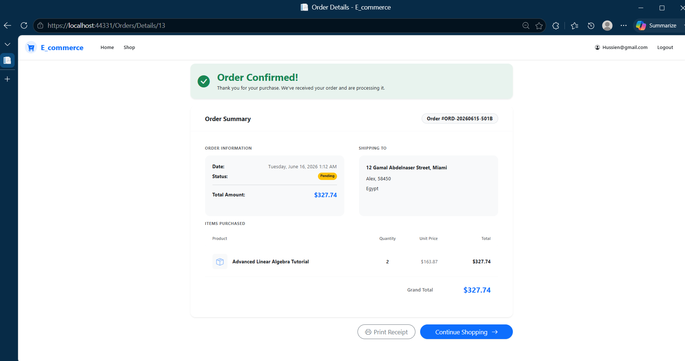
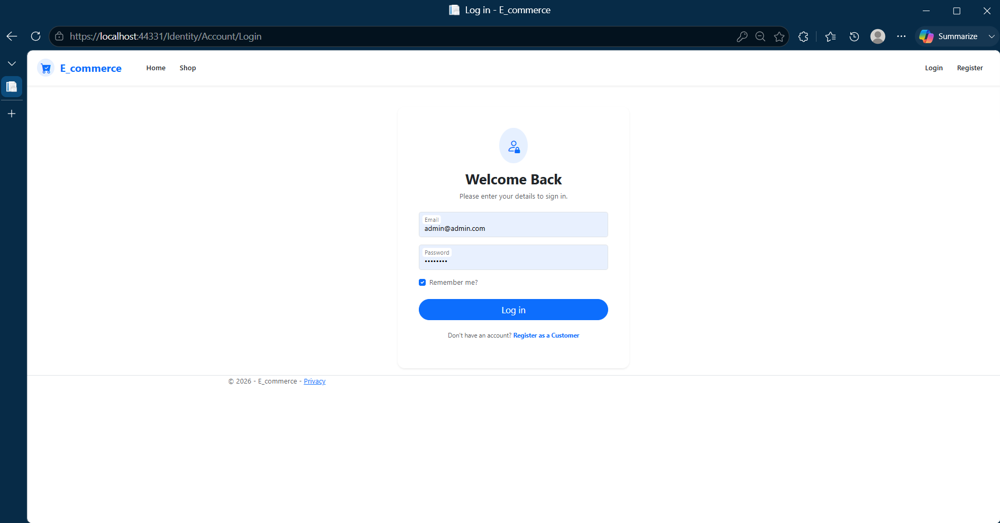

# Online Bookstore E-Commerce Platform


## 📖 Project Overview
The **Online Bookstore E-Commerce Platform** is a scalable, full-featured web application engineered to digitize bookstore operations. It provides a seamless, intuitive shopping experience for book enthusiasts—allowing them to browse extensive catalogs, manage their shopping carts, and securely place orders. Simultaneously, it equips administrators with a robust backend dashboard to efficiently manage book inventory, categories, and fulfill customer orders.

---

## ✨ Key Features & Technical Highlights

### Core Engineering Achievements
- **Data Integrity:** Implemented the **Repository** and **Unit of Work** patterns to guarantee transactional integrity during checkout, ensuring complex multi-table updates (orders, inventory, carts) succeed or fail as a single unit without data corruption.
- **Dynamic Cart:** Engineered a robust hybrid shopping cart system that intelligently transitions guest data from memory (`Session` state) to persistent SQL database storage seamlessly upon user login.
- **Security:** Secured administrative modules and critical workflows using ASP.NET Core Identity's **Role-Based Access Control (RBAC)** and MVC `Areas` to isolate the administration dashboard from the public storefront.

### Customer Features
- **Intuitive Browsing:** Browse books by category, author, or ISBN.
- **Hybrid Shopping Cart:** Add books to the cart as a guest or an authenticated user.
- **Secure Checkout:** Streamlined order finalization process.
- **Account Management:** Track past orders and update personal profiles.

### Admin Features
- **Catalog Management:** Full CRUD operations for books, authors, and literary categories.
- **Order Management:** View, process, and track the fulfillment status of customer orders.

---

## 🖼️ Project Showcase: The User Journey

### 1. Storefront Experience
A modern, responsive landing page inviting users to browse our extensive book collection.


### 2. Authentication Flow
Secure account creation and authentication using ASP.NET Core Identity.



### 3. The Authenticated User
A personalized view for logged-in users, granting access to account-specific features and order history.


### 4. Catalog Browsing & Filtering
Powerful catalog capabilities allowing users to filter books by specific literary categories, authors, and price ranges.



### 5. Seamless Checkout Pipeline
A robust purchasing pipeline showcasing our dynamic hybrid shopping cart, secure checkout data collection, and final order confirmation.




### 6. Administrative Control Panel
A highly secured entry point to the backend control panel utilized by staff to manage the bookstore's inventory and fulfill customer orders.


---

## 🛠️ Tech Stack & Tooling

* **Framework:** ASP.NET Core MVC (.NET 10.0)
* **Language:** C# 14
* **ORM:** Entity Framework Core 10.0
* **Database:** Microsoft SQL Server
* **Authentication:** ASP.NET Core Identity
* **Front-end:** Razor Views, Bootstrap 5, Vanilla CSS, FontAwesome

---

## 🏗️ Architecture

This platform was built utilizing an **N-Tier Architecture** to ensure clean separation of concerns, scalability, and maintainability:

* **Web / Presentation Layer:** Contains MVC Controllers and Razor Views, strictly handling UI rendering and HTTP request routing.
* **Service / Business Logic Layer:** Encapsulates core domain operations (like the Cart migration logic and Order processing logic).
* **Data Access Layer:** Uses **Entity Framework Core** alongside the **Repository Pattern** and **Unit of Work**. This abstracts direct database queries away from the controllers, ensuring that complex database transactions (e.g., checkout) are highly maintainable and fail-safe.

---

## 🚀 Getting Started

Follow these steps to run the Bookstore Platform locally using Visual Studio:

1. **Clone the repository:**
   ```bash
   git clone https://github.com/yourusername/online-bookstore.git
   ```
2. **Open the Solution:**
   Open the `.sln` file using Visual Studio 2022 (or newer).
3. **Configure the Database:**
   Ensure your local SQL Server is running. Open the **Package Manager Console (PMC)** and apply the migrations:
   ```powershell
   Update-Database
   ```
4. **Run the Application:**
   Press `F5` or click the **Start** button in Visual Studio to launch the application.

---

## 📂 Project Structure

```text
OnlineBookstore.sln
├── WebProject/                  # Presentation Layer (ASP.NET Core MVC)
│   ├── Areas/Admin/             # Secured Admin Dashboard
│   ├── Controllers/             # MVC Routing & Request Handling
│   ├── Views/                   # Razor Views & UI
│   └── wwwroot/                 # Static Assets (CSS, JS, Images)
├── CoreProject/                 # Data Access & Domain Layer
│   ├── Entity/                  # Domain Models (Books, Categories, Orders)
│   ├── Repository/              # Generic Repositories & Unit of Work implementations
│   └── DataBase/                # Entity Framework Core DbContext
└── README.md
```
